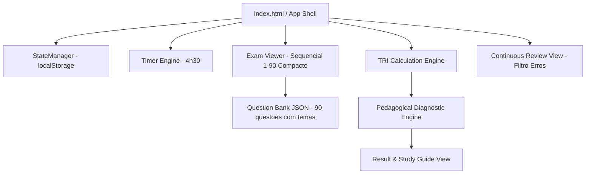

# Arquitetura — Simulado Enem Aprovejá

## 1. Visão Geral do Sistema
O **Simulado Enem Aprovejá** é uma Single Page Application (SPA) cliente-side estática, de alta performance e consumo zero de backend em runtime. Todo o estado do exame, navegação, contagem regressiva, cálculo TRI e diagnóstico pedagógico ocorrem no navegador do aluno.



---

## 2. Schema Canônico do Banco de Questões (`questions.json`)
Cada questão possui metadados temáticos para viabilizar o diagnóstico didático cirúrgico:

```json
{
  "block_id": "dia-1",
  "name": "Dia 1 — Linguagens, Códigos e Ciências Humanas",
  "duration_seconds": 16200,
  "questions": [
    {
      "id": "q1",
      "index": 1,
      "area": "Linguagens e Códigos",
      "discipline": "Língua Portuguesa",
      "topic": "Interpretação e Funções da Linguagem",
      "context": "Texto base ou poema de apoio...",
      "question": "Enunciado da questão...",
      "options": {
        "A": "Texto da alternativa A",
        "B": "Texto da alternativa B",
        "C": "Texto da alternativa C",
        "D": "Texto da alternativa D",
        "E": "Texto da alternativa E"
      },
      "correct": "C",
      "explanation": "Explicação didática do gabarito...",
      "study_reference": "Capítulo 3: Teoria da Comunicação e Funções da Linguagem",
      "tri_params": {
        "a": 1.25,
        "b": 0.45,
        "c": 0.20
      }
    }
  ]
}
```

---

## 3. Modelo Matemático TRI e Motor de Diagnóstico

### 3.1 Estimador Logístico de 3 Parâmetros
Probabilidade de acerto do participante com proficiência $\theta$:
$$P_i(\theta) = c_i + \frac{1 - c_i}{1 + e^{-D \cdot a_i \cdot (\theta - b_i)}}$$
Onde $D = 1.7$, convertendo a proficiência $\theta$ para a escala do ENEM: $\text{Nota} = \text{round}(500 + 100 \cdot \hat{\theta})$.

### 3.2 Motor de Diagnóstico Pedagógico
- **Agrupamento por Tópico:** Contabiliza acertos/erros por tema disciplinar.
- **Detecção de Pontos Fortes:** Temas com acerto $\ge 80\%$ e acerto consistente em itens de nível fácil e médio.
- **Detecção de Déficit Prioritário:** Temas com acerto $\le 50\%$ ordenados por impacto e frequência de questões.
- **Guia de Estudos Contextual:** Mapeamento automático dos temas deficitários para módulos e materiais recomendados de estudo.

---

## 4. Persistência e Resiliência (`localStorage`)
Chave única no navegador: `simulado_enem_state_v1`
Armazena bloco selecionado, respostas, questões marcadas para revisão, tempo restante e o relatório pedagógico gerado ao término.

---

## 5. Estrutura de Arquivos da Aplicação
```text
/
├── mockup.html                 # Mockup interativo e navegável completo
├── index.html                  # App Shell de produção
├── src/
│   ├── css/
│   │   ├── reset.css           # Reset CSS
│   │   ├── tokens.css          # Paleta Ânima/ENEM, tipografia compacta mobile-first
│   │   └── app.css             # Componentes, header não-encavalado, cards e diagnóstico
│   ├── js/
│   │   ├── app.js              # Inicialização e orquestração de telas
│   │   ├── storage.js          # Driver do localStorage
│   │   ├── timer.js            # Engine do cronômetro de 4h30
│   │   ├── tri-engine.js       # Algoritmo TRI 3PL e escala 0–1000
│   │   ├── diagnostic.js       # Agrupamento temático, pontos fortes, déficits e guia de estudo
│   │   └── ui.js               # Renderizadores da prova, modais e lista contínua de revisão
│   └── data/
│       ├── dia-1.json          # 90 questões com metadados temáticos
│       └── dia-2.json          # 90 questões com metadados temáticos
```
